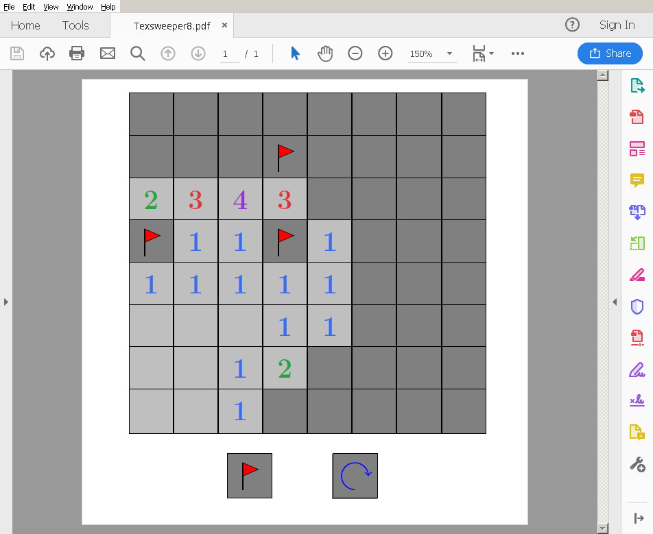
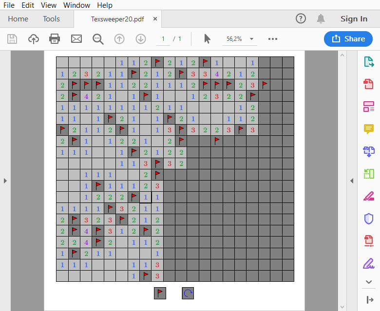

# Texsweeper
This is a Minesweeper game, implemented in Latex and playable in a PDF viewer. Currently it only runs in Adobe Reader. On Linux in can be used through Wine.

Features:

- Randomized mine layout every time
- Restart game without restarting PDF viewer
- Rendering glitches
- Set flags and remove flags
- Sometimes, it does not crash your PDF viewer

## Download
Compiled PDFs can be downloaded from the [releases section](https://github.com/fllor/Texsweeper/releases).

## License
Texsweeper is licensed under the GNU General Public License v3. 
